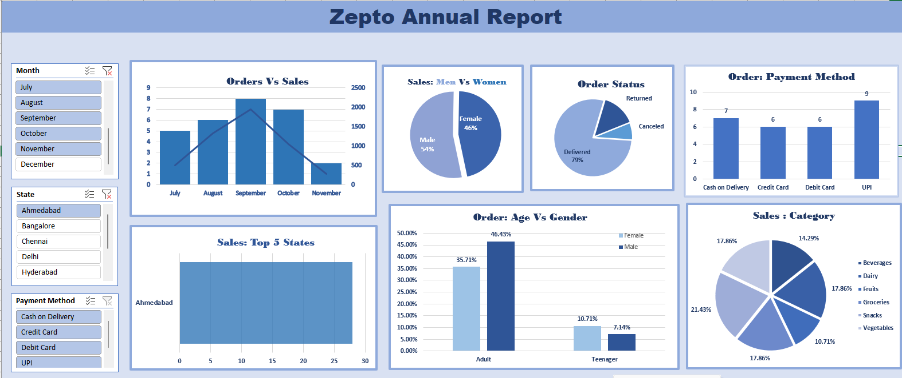

# Zepto Sales Analytics Dashboard

## Overview

This project presents an interactive Excel dashboard built to analyze Zepto sales data and generate business insights using Pivot Tables, Pivot Charts, and Slicers.

The dashboard helps visualize sales trends, customer demographics, payment preferences, product category performance, and order status distribution.

---

## Tools Used

- Microsoft Excel
- Pivot Tables
- Pivot Charts
- Slicers
- Data Cleaning
- Data Analysis

---

## Dataset Description

The dataset contains:

- Order ID
- Order Date
- Customer ID
- City
- Product Category
- Product Name
- Sales Amount
- Gender
- Age
- Age Group
- Order Status
- Payment Method

---

## Dashboard Preview

---

## Key Skills Demonstrated

- Data Cleaning
- Data Transformation
- Excel Dashboard Design
- Business Intelligence
- Data Visualization
- Pivot Tables & Charts
- Analytical Thinking

---

## Author

Ragini Kumari

MCA, Thapar Institute of Engineering and Technology

GitHub: https://github.com/ragini-ar
